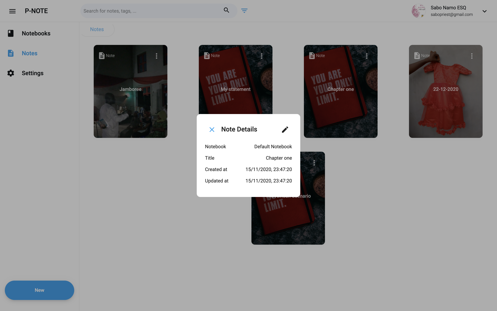

# PNotes

With PNotes, you can jot down important ideas and access your notes from different devices at any time.
With just a click and either your Google or Twitter account, you can experience all that PNotes has for you. You can group related notes to form a notebook (just as you would for different courses).
PNotes allows you to style your ideas in a way that will improve comprehension when next you check your notes. Also, you can add beautiful photos and code snippets to your notes.
And once you’re done, you can export your notes to PDF or print directly with a connected or wireless printer.

Check it out at **[PNotes](https://pinotes.web.app)**

PNotes was built using Angular & Firebase.

## Setting up

Clone the project to your computer and run `npm install` **Ensure you that NodeJs and npm are installed on your computer**

## Development server

Run `ng serve` for a dev server. Navigate to `http://localhost:4200/`. The app will automatically reload if you change any of the source files.

## Build

Run `ng build` to build the project. The build artifacts will be stored in the `dist/` directory. Use the `--prod` flag for a production build.

## Snapshots of the app in action

